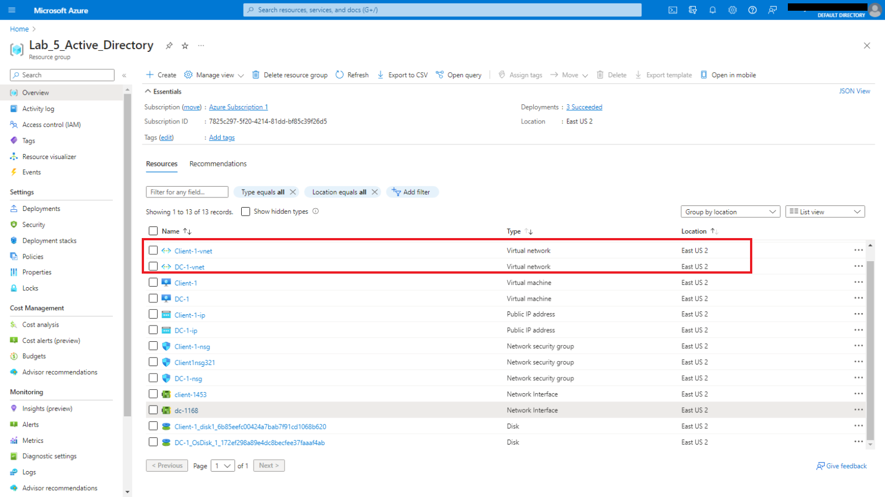

#

<h1>On-premises Active Directory Deployed in Azure </h1>
This tutorial outlines the implementation of on-premises Active Directory within Azure Virtual Machines.

<h2>Environments and Technologies Used</h2>

- Microsoft Azure (Virtual Machines/Compute)
- Remote Desktop
- Active Directory Domain Services
- PowerShell
<h2>Operating Systems Used </h2>

- Windows 10 (21H2)
- Windows Server 2022

<h2>Key Objectives</h2>

- Create two VMs (Domain Controller on the server / Windows 10)
- Install Active Directory (AD)
- Ensure Connectivity between both VMs
- Create an Administrator and User Accounts
- Login with Admin/User Account to verify setup

<h2>Actions and Observations</h2>

# Create Resources

**1.** Within Azure, create a Resource Group (RG) that has two Virtual Machines (VMs) on the same network, or Virtual Netowrk (vNet). To confirm that both VMs on the same network, view the _topology_ in Network Watcher.        

    
**2.** ***Client-1*** is running Windows 10 and the ***Domain Controller*** is running Windows Server 2022, where its iP address is set to static.    

# Ensure Connectivity

**3.** Ensure that there is _connectivity_ between the Client and Domain Controller. Remote Desktop into Client-1 and iniate a ping request to the Domain Controller. As shown the example shown below, if the ping **_request timed-out_** , the _inbound_ ICMP requests are probably disabled for the Domain Controller. To enable, go to Network Security Group, select Inbound Rules, and enable. Try pinging the Domain Controller to observe changes.
    

# Install Active Directory

**4.** Remote Desktop into the Domain Controller to install AD by selecting _Add roles and features_ . 
    

**5.** Create a new Forest. Restart the Virtual Machine and remote back in to the DC with the username as the domain you created.
  

# Create an Admin and User Account

**6.** Within Active Directory create two Organizational Groups: Employees and Admins.

**7** Create a new user and add them to the _Admin Domain_ .    
**User:** Haribo Gummy    
**Login**: haribo_admin    

   

**8.** Log out of the Domain Controller and remote back in using the credentials created for **Haribo Gummy**.    
 

**9**

**10**    

**11.**    

**12.**

**14.**

    

